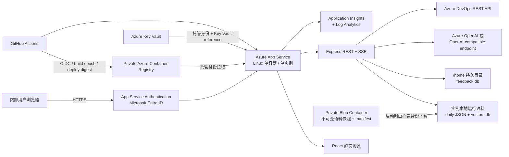

# Commit AI Resolver Azure 部署设计

- 状态：Proposed
- 日期：2026-09-04
- 范围：把当前 demo 安全、可重复、可回滚地部署到 Azure；本文不执行云资源创建
- 首期目标环境：单租户、内部用户、单区域、低并发 demo
- 推荐方案：Azure App Service（Linux 自定义容器）+ Azure Container Registry + Microsoft Entra ID + Key Vault + Application Insights

## 1. 决策摘要

首期不拆分 React 与 Express。Vite 构建产物继续由 `api/server.js` 以静态文件提供，浏览器、REST API 和 SSE 使用同一域名。应用构建为 Linux 容器，推送到私有 Azure Container Registry（ACR），再由单实例 Azure App Service 运行。

所有用户请求先经过 App Service 内置的 Microsoft Entra 身份认证；应用只对指定租户和指定用户组开放。OpenAI/Azure OpenAI 与 Azure DevOps 凭据保存在 Key Vault，通过 App Service 托管身份和 Key Vault reference 注入应用设置，不写入代码、镜像或 GitHub secret。

首期以“固定语料快照”上线：只把运行所需的 `data/daily/` 和 `data/vectors.db` 打成不可变数据包，放入私有 Blob container；应用启动时通过托管身份下载指定版本到实例本地临时盘。查询/反馈数据库单独写入 App Service 的持久目录，并禁用定时刷新。这样可以尽快上线真实可用的 demo，同时让代码镜像不夹带内部语料，并把 SQLite、多实例并发写和定时任务的风险限制在明确边界内。

远程 `/mcp` 首期不作为交付范围。浏览器登录 cookie 不能替代远程 MCP 所需的 OAuth 2.1 resource-server 流程；在完成 OAuth discovery、audience 校验和客户端兼容验证之前，Azure 环境应拒绝或隐藏 `/mcp` 与安装脚本路由。

## 2. 当前实现审计

| 项目 | 当前事实 | 对部署的影响 |
|---|---|---|
| Web 形态 | React/Vite 前端；Express 同时提供 `/api/*`、SSE、`/mcp` 和生产静态 UI | 可以先做单容器、同源部署，不需要 Static Web Apps + API 双站点 |
| 监听地址 | `HOST` 默认 `127.0.0.1`，`PORT` 默认 `4399` | 容器中必须设置 `HOST=0.0.0.0`；App Service 需把流量转发到容器端口 |
| 用户身份 | UI、API、MCP 均无应用级登录；查询用户固定为 `local-user` | 公网发布前必须添加外部身份认证；用户标识需要从受信任的 App Service 身份头读取 |
| 数据 | `daily/*.json`、`vectors.db`、`feedback.db`、diff cache、refresh checkpoint | 不能依赖容器临时文件系统；必须区分只读语料和可写反馈数据 |
| 本机数据量 | `data/` 共约 2.13 GiB / 17,042 文件；首期运行快照约 166.23 MiB（daily 28.13 MiB、vectors 137.84 MiB、feedback 0.26 MiB） | 私有 Blob 只保存运行快照；排除 `models/`、`public/`、`enriched/`、`eval/`、diff cache 和 SQLite WAL/SHM |
| 数据交付 | 整个 `data/` 已被 `.gitignore` 排除，GitHub checkout 不含运行语料 | 数据必须走独立、受控、可审计的私有 Blob 发布流程，不能假设 CI 能从仓库重建 |
| Native 依赖 | `better-sqlite3`、`sqlite-vec` | 必须在目标 Linux/Node 运行时内构建和测试，不能打包本机 Windows `node_modules` |
| MCP session | session map 存在单进程内存中 | 首期必须单实例；多实例前需无状态化/共享 session 或确认 sticky session 行为 |
| 定时刷新 | 可由 API 进程内 `ENABLE_SCHEDULED_REFRESH=1` 启动 | 首期关闭，避免多副本重复任务、发布重启中断和语料写入丢失 |
| 旧部署资产 | `deploy/prepare-api.ps1` 面向 Windows App Service/HttpPlatformHandler，并在 Windows 本机安装 native module | 只作为历史参考；新部署链路使用 Dockerfile + ACR，不直接复用该 zip 包 |
| CI | 现有 GitHub Actions 只覆盖 eval/prompt gate | 需要新增容器构建、镜像扫描、OIDC 登录和 Azure 部署工作流 |

当前工作区中 `docs/issue-time-window-local-ltr-design-2026-09-03.md` 已有未提交修改；本设计不改动该文件。

## 3. 目标与非目标

### 3.1 首期目标

1. 由内部用户通过 Microsoft Entra 登录后访问 dashboard。
2. `/api/days`、日期详情、聊天、SSE、调查、反馈和 metrics 在 Azure 可用。
3. 凭据不进入仓库、容器层、日志或前端 bundle。
4. 部署可由 GitHub Actions 重复执行，可按镜像 digest 回滚。
5. App Service 重启后反馈数据仍存在；语料快照与发布版本可追溯。
6. 有 readiness/health check、请求/异常观测、告警和部署验证。

### 3.2 首期非目标

- 匿名公网访问。
- 多区域、高可用或自动横向扩容。
- 在 Web 进程内持续抓取 ADO 并更新向量库。
- 把本地 2.13 GiB 全量工作目录上传到 Azure。
- 首期开放远程 MCP。
- 首期把 SQLite 全部迁移到 Azure SQL/Azure AI Search。

## 4. 推荐架构



### 4.1 Azure 资源

| 资源 | 用途 | 首期配置原则 |
|---|---|---|
| Resource Group | 隔离 demo 资源 | 名称与 region 由组织规范决定；所有资源统一 tag：`app`、`env`、`owner`、`costCenter` |
| Azure Container Registry | 存放私有 Linux 镜像 | 禁用 anonymous/admin user；CI 只获 push，Web App 托管身份只获 pull |
| App Service Plan | 容器计算 | Linux；选择能提供足够内存且支持 Always On 的 SKU；首期固定 1 instance |
| App Service Web App | 运行 UI/API | HTTPS only、最低 TLS 1.2、HTTP/2、Always On、单实例、App Service storage enabled |
| Microsoft Entra app registration | 内部用户登录 | workforce tenant、single tenant；只允许被授权组/主体访问 |
| Key Vault | AI/ADO 凭据 | RBAC 模式、soft delete、purge protection；Web App 托管身份仅 Secret Get |
| Application Insights + Log Analytics | traces、requests、exceptions、alerts | 不采集请求/响应正文、prompt、diff、Authorization/cookie；配置采样和保留期 |
| Storage Account + private Blob container | 存放不可变语料快照、manifest 和 feedback 备份 | 禁止 public access；启用版本/保留策略；Web App 托管身份仅获 seed container 读取权限 |

区域应优先与 AI endpoint、数据驻留要求及主要用户接近。本文不硬编码 region；创建资源前由订阅 owner 确认。

### 4.2 为什么选 App Service 单容器

- 当前 API 已经能提供构建后的 UI，同源部署改动最少，并保留 SSE。
- App Service 有内置 Entra 身份认证、托管身份、Key Vault reference、health check 与容器支持。
- 自定义 Linux 镜像让 `better-sqlite3` 和 `sqlite-vec` 在目标 ABI 中构建，避免 Windows zip 部署的 native module 不匹配。
- 单实例与当前的 SQLite 写入和内存 MCP session 语义一致。

不选择 Static Web Apps + 独立 API，是因为它会引入双域名认证、CORS、SSE 和部署协调复杂度，却不能解决本地 SQLite 的状态问题。不选择 AKS，是因为首期 demo 不需要集群运维成本。

## 5. 身份与安全设计

### 5.1 入站用户认证

1. 为 App Service 启用内置 Authentication，identity provider 使用 Microsoft Entra workforce tenant。
2. `requireAuthentication=true`，网站根路径对未登录浏览器重定向登录。
3. 授权范围限制为指定 Entra group/allowed principals；不能只做到“租户内任何用户都能访问”。
4. `/healthz` 加到 auth excluded path，但只返回 `{status, version}`，不返回配置、文件路径、模型名或依赖状态细节。
5. API 只从 App Service 注入的 `X-MS-CLIENT-PRINCIPAL*` 头获取用户 ID；Azure 环境缺少该头时 fail closed。开发环境才允许 `local-user` fallback。
6. 不在应用内新增 MSAL/JWT/JWKS 中间件；认证和 token 校验由 App Service 平台完成，代码仅做最小身份映射和审计字段记录。

### 5.2 MCP 边界

Azure 首期设置 `ENABLE_REMOTE_MCP=0`：

- `/mcp` 返回 `404` 或 `503`，不建立 session。
- `/install/setup-commit-resolver.ps1` 和 `/install/skills/*` 在 Azure 环境关闭，避免下载到仍按匿名 localhost 假设配置的客户端。
- 本地开发仍保持现状。

后续要开放远程 MCP，必须另做设计并满足：OAuth protected-resource metadata、authorization-server discovery、PKCE、token audience/resource 校验、每次请求 Bearer token、用户映射、客户端兼容测试，以及多实例 session 设计。App Service 登录 cookie 本身不等于完整的远程 MCP OAuth 实现。

### 5.3 出站凭据

- `OPENAI_API_KEY`、`OPENAI_EMBEDDING_API_KEY`、`ADO_PAT` 等只存 Key Vault。
- App Service 使用 system-assigned managed identity 读取 Key Vault secret；应用设置使用 Key Vault reference。
- ACR 拉取使用 managed identity，不启用 registry admin password。
- GitHub Actions 通过 workload identity federation/OIDC 登录 Azure，不保存长期 client secret 或 publish profile。
- 若使用 Azure OpenAI v1 endpoint，`OPENAI_BASE_URL`/`OPENAI_EMBEDDING_BASE_URL` 指向组织批准的 endpoint，模型变量填写 deployment name；首期沿用 key 认证，后续可改为 managed identity token provider。
- ADO 凭据使用最小只读 scope、专用身份和明确轮换日期；不得使用个人长期 PAT 作为最终状态。

### 5.4 网络

首期是“公网 HTTPS endpoint + Entra 强制登录”，不是 anonymous public endpoint。若组织政策要求 private-only，则增加 VNet integration、Private Endpoint、private DNS，并通过企业网络/VPN 访问；这会显著增加首期准备工作，应在创建资源前决定。

## 6. 数据与状态设计

### 6.1 首期固定快照

首期数据包只包含：

- `data/daily/*.json` 与必要的 `index.json`；
- `data/vectors.db` 主文件；
- `data-manifest.json`：数据版本、生成时间、embedding model、dimensions、document template version、文件 SHA-256、日期范围和 commit 数量。

明确排除：

- `data/models/`、`data/public/`、`data/enriched/`、`data/eval/`；
- `data/diffs/`；
- 所有 `*-wal`、`*-shm`；
- `.env`、token、PAT 与本机 `node_modules`。

数据包发布到禁止 public access 的 Blob container，使用不可变 blob version/唯一 snapshot ID。首次上传前必须完成数据 owner 审批、数据分级以及 secret/PII 扫描；`data/` 中可能来自私有 ADO 的 commit、作者和工作项内容，不能因为它已在本机存在就默认允许上传云端。

容器启动时使用 App Service 托管身份下载 `DATA_SNAPSHOT_URI` 指定的版本，校验 `DATA_SNAPSHOT_SHA256` 和 manifest 后解压到实例本地临时目录（例如 `/tmp/commit-resolver/corpus`），让 SQLite 可以创建 WAL/SHM。下载或校验失败时 readiness 保持失败，不能回退到未知版本。`ENABLE_SCHEDULED_REFRESH=0`，避免对临时语料的更新造成“运行时看见、重启后消失”。

`feedback.db` 使用新增的 `FEEDBACK_DB_PATH=/home/site/data/feedback.db`，不再被 `DATA_DIR` 绑在语料目录。Linux custom container 开启 `WEBSITES_ENABLE_APP_SERVICE_STORAGE=true`，并保持单实例。SQLite 数据库使用进程内单 writer；部署/备份前执行 checkpoint 并生成一致性副本。

> 风险接受：App Service `/home` 是持久共享存储，不是为高吞吐 SQLite 设计的数据库服务。首期只允许低并发 demo 与单实例。若出现锁等待、I/O latency 或需要 scale-out，应停止扩大使用范围并执行第二阶段迁移。

### 6.2 第二阶段：可持续刷新和横向扩容

当需要自动刷新、多实例或生产 SLA 时：

1. 把首期 Blob snapshot 发布流程演进为 daily JSON/diff 分层存储与 active manifest 原子发布；
2. chat query、feedback、prompt events 迁到 Azure SQL Database 或 PostgreSQL；
3. 向量与关键词检索迁到 Azure AI Search，或选择另一个经容量/召回评测批准的托管 vector store；
4. ADO 抓取/摘要/embedding 由独立的定时 Container Apps Job、Function 或 ADO pipeline 执行；
5. writer 先生成新版本并验证，再原子更新 active manifest，Web 端只读取已发布版本；
6. API 去除本地可变状态后才能开启多实例与 autoscale。

第二阶段不是首期上线的阻塞项，但必须在承诺持续刷新、并发 SLA 或灾难恢复目标之前完成。

## 7. 需要的代码与仓库变更

### 7.1 应用变更

| 文件/区域 | 变更 |
|---|---|
| `api/server.js` | 新增 `/healthz` 与 `/readyz`；Azure 环境强制身份头；使用真实 user ID；用 feature flag 关闭远程 MCP/installer；优雅处理 `SIGTERM`，关闭 SQLite/MCP session |
| `api/db.js` | 支持 `FEEDBACK_DB_PATH`；启动时验证目录可写；提供 WAL checkpoint/一致性备份入口 |
| `src/services/vector-store.js` | 启动时记录语料 manifest；readiness 验证 index contract、vector count 和 embedding dimensions |
| `ui/` | 不需要 API base 改造，继续同源 `/api`；补充登录失败/401/403 的用户提示（如平台未直接拦截） |
| tests | 增加 auth-header mapping、Azure fail-closed、MCP-disabled、health/readiness、snapshot download/checksum 和 restart persistence 测试 |

### 7.2 构建与基础设施文件

建议新增：

```text
Dockerfile
.dockerignore
deploy/container-entrypoint.sh
deploy/build-data-seed.ps1
deploy/download-data-snapshot.js
infra/main.bicep
infra/modules/acr.bicep
infra/modules/app-service.bicep
infra/modules/key-vault.bicep
infra/modules/monitoring.bicep
infra/parameters/demo.bicepparam
.github/workflows/deploy-azure.yml
```

Dockerfile 使用 multi-stage build：

1. 在受支持的 Node.js LTS Linux image 中分别 `npm ci` API/前端依赖；
2. `npm run build --prefix ui`；
3. 运行 backend tests、UI build check、native module import smoke test；
4. final image 只复制 production dependencies、API、必需的 `src/services|config|prompts`、UI dist 和 snapshot downloader，不复制 `data/`；
5. 使用非 root 用户，端口固定为 `8080`，`HOST=0.0.0.0`；
6. pin base image digest，并由 Dependabot/计划任务更新。

不要把当前 Windows `deploy/prepare-api.ps1` 生成的 `node_modules` 拷入 Linux image。

## 8. 配置矩阵

| 设置 | 首期值/来源 | 说明 |
|---|---|---|
| `NODE_ENV` | `production` | 生产模式 |
| `HOST` | `0.0.0.0` | 容器监听所有接口；安全边界由 App Service 提供 |
| `PORT` | `8080` | 与容器 EXPOSE/启动配置一致 |
| `WEBSITES_PORT` | `8080` | App Service 将 HTTP 流量转到容器端口；该设置不会自动注入容器 |
| `WEBSITES_ENABLE_APP_SERVICE_STORAGE` | `true` | 持久化 `/home` 下的 feedback 数据 |
| `DATA_DIR` | `/tmp/commit-resolver/corpus` | 由 entrypoint 从固定版本的 private Blob snapshot 初始化 |
| `VECTORS_DB` | `/tmp/commit-resolver/corpus/vectors.db` | 实例本地语料副本 |
| `FEEDBACK_DB_PATH` | `/home/site/data/feedback.db` | 需要新增代码支持 |
| `DATA_SNAPSHOT_URI` | App setting | 指向 private Blob 的固定 version/唯一 snapshot ID，不使用可变 `latest` |
| `DATA_SNAPSHOT_SHA256` | App setting | 启动下载后的完整性校验 |
| `ENABLE_SCHEDULED_REFRESH` | `0` | 首期固定快照 |
| `ENABLE_REMOTE_MCP` | `0` | Azure 首期关闭远程 MCP/installer |
| `ALLOWED_ORIGINS` | 留空或仅正式域名 | 同源无需开放泛 CORS；不能使用 `*` |
| `OPENAI_BASE_URL` | App setting | 非 secret；Azure OpenAI 时使用批准 endpoint |
| `OPENAI_MODEL` / `OPENAI_FAST_MODEL` | App setting | provider 的 model/deployment name |
| `OPENAI_API_KEY` | Key Vault reference | secret |
| `OPENAI_EMBEDDING_*` | App setting + Key Vault reference | 必须与 `vectors.db` manifest 完全一致 |
| `ADO_PAT` 或 `ADO_BEARER_TOKEN` | Key Vault reference | 仅在需要实时 diff/work item 时配置 |
| `APPLICATIONINSIGHTS_CONNECTION_STRING` | App setting | 由 IaC 关联 |

`OPENAI_EMBEDDING_MODEL`、dimensions、document template version 与 seed manifest 不一致时，readiness 必须失败，不能静默混用索引。

## 9. CI/CD 与发布

### 9.1 Pull request gate

1. `npm ci`（使用 lockfile）；
2. 现有 deterministic tests 与 prompt tests；
3. UI lint + build；
4. Docker build；
5. 在容器内导入 `better-sqlite3`/`sqlite-vec` 并启动 API；
6. 使用无 secret stub/smoke data 验证 `/healthz`、`/readyz`、`/api/days`；
7. dependency/image vulnerability scan；高危漏洞阻止发布或必须有有期限的例外。

### 9.2 Main 分支发布

1. GitHub Actions 通过 OIDC 登录 Azure；
2. 构建并推送 `commit-ai-resolver:<git-sha>`；禁止只发布可变 `latest`；
3. 记录 image digest、Git SHA、snapshot ID 与 data manifest hash；
4. IaC what-if 后部署 Bicep；
5. App Service 切到指定 image digest；
6. 等待 health/readiness，通过登录态 smoke test 验证主要流程；
7. 失败时恢复上一 digest；数据库 schema 变更必须向后兼容或有显式回滚方案。

GitHub `production` environment 应设置 reviewer approval。若需要无感切换，改用支持 deployment slot 的 App Service SKU，并验证 persistent feedback 数据不会被 slot swap 覆盖；这不是低成本 demo 的默认要求。

## 10. 可观测性与运维

### 10.1 Health endpoints

- `/healthz`：进程存活、版本；必须快速、无外部依赖、匿名但不泄露信息。
- `/readyz`：daily directory 可读、vector index contract 正确、vector count > 0、feedback DB 可写；AI/ADO 短暂不可用可以标记 degraded，不一定让实例退出流量。
- App Service Health Check 使用 `/healthz`；部署 smoke test 使用 `/readyz`。

### 10.2 Telemetry

记录：request ID、route template、status、latency、AI provider latency/429、agent iteration count、vector search latency、data version、exception type、部署版本。

禁止记录：prompt/response 正文、commit diff 正文、工作项截图、Authorization、cookie、PAT、API key、完整用户邮箱。用户审计建议保存 Entra object ID 的受控映射或不可逆标识，并由隐私要求决定保留期。

### 10.3 Alerts

- 5xx rate 或未处理异常持续超阈值；
- `/healthz` 失败；
- p95 latency 显著上升；
- AI/embedding 429、401/403 或 timeout；
- feedback storage 接近配额；
- Key Vault reference resolution 失败；
- 容器启动失败或 ACR pull 失败。

## 11. 验收与上线检查表

### 11.1 功能验收

- [ ] 未登录访问首页会进入 Entra 登录，未授权用户不能读取任何 commit/metrics 数据。
- [ ] 授权用户可以浏览日期、仓库和 commit 详情。
- [ ] JSON 与 SSE chat 都能完成，流式事件不中断。
- [ ] feedback 写入后重启 App Service，数据仍可查询。
- [ ] Azure 环境 `/mcp` 与 `/install/*` 不可用；本地模式仍可用。
- [ ] `OPENAI_*` 未配置时 UI 给出可理解的降级状态；配置后能完成 chat。
- [ ] 若配置 ADO 凭据，release/diff/work item 请求只读且成功。

### 11.2 安全验收

- [ ] 仓库历史、GitHub Actions log、镜像层、Blob metadata 和 App Service log 均无 secret。
- [ ] 语料快照已经数据 owner 批准，并通过 secret/PII 扫描；Storage public access 已关闭。
- [ ] ACR admin account 关闭；Web App 只具备 pull 权限。
- [ ] Key Vault 只授权 Web App identity 读取需要的 secret。
- [ ] HTTPS only、TLS 最低版本、SCM endpoint 策略符合组织标准。
- [ ] CORS 不含 `*`，installer 路由不再返回 `Access-Control-Allow-Origin: *`。
- [ ] 指定 Entra group 之外的同租户用户被拒绝。

### 11.3 发布与恢复验收

- [ ] 从空白 resource group 可通过 Bicep 重建资源。
- [ ] 同一 Git SHA 可重建相同代码镜像；同一 snapshot ID/manifest hash 可恢复相同语料。
- [ ] 可在规定时间内回滚到上一 image digest。
- [ ] feedback DB 有已验证的备份与恢复演练。
- [ ] 资源 budget/成本告警、owner 和过期日期已设置。

## 12. 实施顺序与工作量边界

### P0：需要 owner 提供/确认

- Azure subscription、tenant、resource group/region 规范；
- 应用命名、域名和环境数量（只有 demo，还是 dev + prod）；
- 可访问的 Entra group/allowed principals；
- AI provider/endpoint/model deployments、配额与网络限制；
- ADO 专用只读身份与凭据策略；
- 是否要求 private endpoint/VNet、数据驻留、日志保留和预算上限。

### P1：让仓库可部署

- 完成 health/readiness、身份映射、MCP feature flag、feedback 路径拆分、优雅退出；
- 新增 Dockerfile、`.dockerignore`、entrypoint、snapshot downloader 与 data manifest；
- 在 Linux 容器内跑完整 smoke test。

### P2：基础设施

- 用 Bicep 创建 ACR、App Service、Key Vault、managed identity、Entra auth、Application Insights/Log Analytics 和 RBAC；
- 录入 Key Vault secret，配置 app settings 和 health check。

### P3：CI/CD

- 配置 GitHub OIDC federation 与 environment approval；
- 增加 build/scan/push/deploy/smoke/rollback workflow。

### P4：首次数据与上线

- 完成数据 owner 审批与 secret/PII 扫描，生成约 166 MiB 的 runtime snapshot 和 manifest，上传 private Blob；
- 部署、登录验证、API/SSE/feedback/restart 验证；
- 建立告警、备份、runbook 和资源过期/清理日期。

## 13. 主要风险与缓解

| 风险 | 影响 | 缓解 |
|---|---|---|
| SQLite 位于 App Service 持久共享存储 | lock/latency/损坏风险 | 只让低并发 feedback DB 使用，单实例、WAL checkpoint、一致性备份；扩容前迁移托管 DB |
| 语料快照过期 | demo 答案不包含新提交 | UI 显示 data version/generatedAt；按受控流程发布新 snapshot；需要自动更新时进入第二阶段 |
| snapshot 下载/校验失败 | 新实例无法 ready | 使用同区域 private Blob、有限重试、checksum、启动告警；保留上一个已验证 snapshot ID 供回滚 |
| Native module ABI 不匹配 | 容器启动失败 | 目标 Linux image 内 `npm ci` + import/startup smoke；不携带 Windows `node_modules` |
| Entra 只认证未授权 | 全租户用户意外可见 | allowed principals/group 限制；用未授权同租户账号做验收 |
| Easy Auth 与远程 MCP 不兼容 | MCP 客户端收到 redirect/cookie 流程失败 | 首期关闭远程 MCP；后续按 MCP OAuth 规范单独设计 |
| SSE 经平台代理超时 | 长回答中断 | 首期保留同源、尽快发 status/token 事件；压测最大 agent iteration；记录 disconnect/timeout |
| PAT 泄露或过期 | ADO 数据暴露/功能失败 | Key Vault、最小 scope、专用身份、轮换告警；优先演进为无长期 secret 的组织批准方案 |
| 观测系统收集敏感正文 | commit/工作项数据泄露 | 不记录 body，OpenTelemetry filter，检查 Application Insights 样本和 retention |

## 14. 开放决策

以下选择不阻塞本文落盘，但阻塞真正创建 Azure 资源：

1. subscription、tenant 与 region 是什么？
2. 允许访问的 Entra group 是哪个？是否只允许公司设备/Conditional Access？
3. 首期 AI 使用 Azure OpenAI、OpenAI API，还是现有自托管 compatible endpoint？
4. demo 是否必须实时访问 ADO diff/work item，还是固定语料即可？
5. 是否要求 private-only networking？
6. 是否首期就必须支持远程 MCP？如果是，需把 OAuth 子项目提升为 P0，不能按本文的快速首期上线。

## 15. 参考资料

- [Configure a custom container for Azure App Service](https://learn.microsoft.com/en-us/azure/app-service/configure-custom-container)
- [Configure Microsoft Entra authentication for App Service](https://learn.microsoft.com/en-us/azure/app-service/configure-authentication-provider-aad)
- [Work with user identities in App Service authentication](https://learn.microsoft.com/en-us/azure/app-service/configure-authentication-user-identities)
- [App Service authsettingsV2 Bicep reference](https://learn.microsoft.com/en-us/azure/templates/microsoft.web/sites/config-authsettingsv2)
- [Securely connect App Service to Azure resources](https://learn.microsoft.com/en-us/azure/app-service/tutorial-connect-overview)
- [Use managed identities for App Service](https://learn.microsoft.com/en-us/azure/app-service/overview-managed-identity)
- [Deploy to App Service with GitHub Actions](https://learn.microsoft.com/en-us/azure/app-service/deploy-github-actions)
- [Enable Azure Monitor OpenTelemetry for Node.js](https://learn.microsoft.com/en-us/azure/azure-monitor/app/opentelemetry-enable)
- [Model Context Protocol authorization](https://modelcontextprotocol.io/specification/2025-06-18/basic/authorization)
