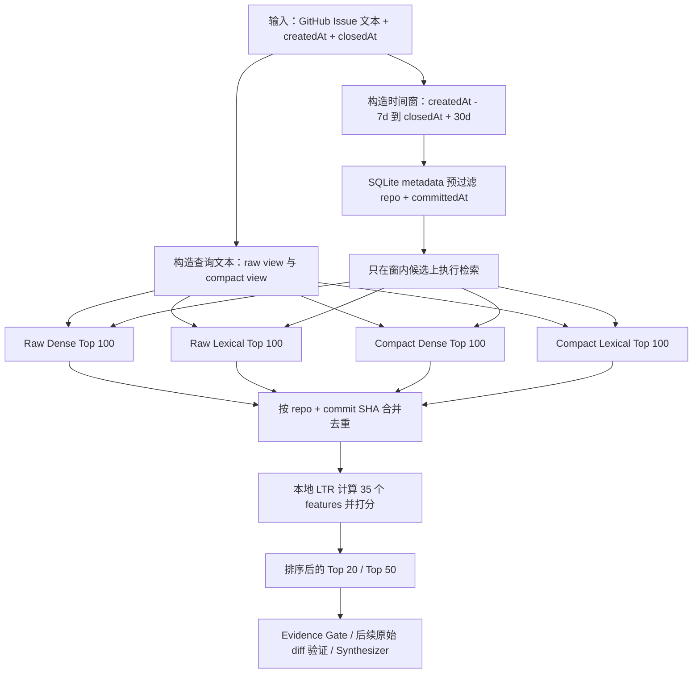
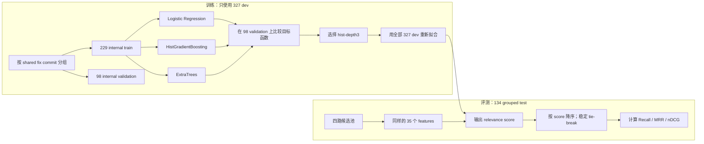

# Issue 时间窗与本地 LTR 检索设计记录（2026-09-03）

## 1. 结论

在 461 条 `facebook/react` Issue → Closing PR → Fix Commit cases 上，最终采用了两段式策略：

1. 用 Issue 的 `createdAt` 和 `closedAt` 构造 `[createdAt - 7 天, closedAt + 30 天]` 的检索时间窗；
2. 在时间窗内分别执行 raw/compact × Dense/Lexical Top 100，合并去重后交给只在 dev 上训练和选型的本地 Learning-to-Rank（LTR）模型重排。

在 134 条 grouped held-out test 上，最终结果为：

| 配置 | Recall@10 | Recall@20 | Recall@50 | MRR@10 | nDCG@10 |
|---|---:|---:|---:|---:|---:|
| 原始 Dense-primary Hybrid | 68.66% | 70.90% | 77.61% | 0.4633 | 0.5177 |
| Issue 时间窗 + Compact Hybrid | 88.81% | 93.28% | 97.01% | 0.6441 | 0.7034 |
| **Issue 时间窗 + 本地 LTR** | **92.54%** | **94.78%** | **97.01%** | **0.6887** | **0.7462** |

最终候选池在 test 上的 gold availability 为 **97.76%**，平均 153.45 条、P95 228 条、最大 290 条；仍有 3 条 gold 没进入候选池，所以任何只在该候选池上重排的模型，其理论 Recall 上限也是 97.76%。

这条新链路当前是 **Issue-specific 的离线实验路径**，没有替换通用 text-only 产品检索，也没有使用 LLM reranker。

## 2. 评测边界

### 2.1 数据和切分

- Corpus：27,646 条 enriched React commits；metadata、FTS5 和 1024 维 Qwen 向量各 27,646 行。
- Cases：461 条机器可验证的 Issue → Closing PR → corpus commit 链路。
- Split：327 dev / 134 test。
- 为防止同一个 fix commit 同时出现在 dev 和 test，先按 shared relevant commit 构建连通组，再做稳定 hash 切分。
- 时间窗和模型选型只使用 dev 信号；test 只报告最终泛化结果。

### 2.2 标签状态

项目仓库中的正式机器标签仍是：

```text
model-prescreened, non-gold, release-gate-ineligible
```

原因不是 Issue/PR/Commit 关系不可验证，而是 461 条尚未逐条完成人工四项 rubric：问题忠实度、修复关系、gold 完整性、query 可用性。因此这些结果可以用于离线诊断、方案比较和人工复核排序，不能用于 release gate，也不能表述为生产准确率或外部盲测。

## 3. 从低 Recall 开始的排查方法

最初的问题不是“哪个模型更强”，而是先回答三个可证伪的问题：

1. gold 是否根本没有进入候选池？
2. gold 已进入候选池但排序太低，还是融合把它挤掉了？
3. 新信号在 dev 上是否真的补回 miss，还是仅仅把候选池做大？

所以每一步都同时记录：

- candidate availability：gold 出现在所有待重排候选中的比例；
- Recall@10/20/50：最终排名的覆盖能力；
- MRR@10、nDCG@10：首个正确结果的位置和前十整体排序质量；
- 平均/P95 pool size：收益对应的计算成本；
- rescued/lost cases：到底救回和损失了哪些 case；
- dev/test gap：是否存在过拟合或分布差异。

## 4. 逐项实验与取舍

### 4.1 先修复 Dense-primary RRF

早期等权 RRF 会让弱 Lexical 排名稀释 Dense：它虽然能救回 Dense miss，也会把更多原有 Dense Top-10 命中挤出去。改成 `rrfK=5, denseWeight=1, lexicalWeight=0.33` 后，461 条全量上救回 6 条 Dense miss，并且没有再挤出 Dense Top-10 命中。

但在 134 test 上 Hybrid Recall@20 仍只有 70.90%，说明仅调融合权重不够。

### 4.2 扩大 raw/compact 四路候选池并训练第一版本地 LTR

将 raw/compact 两种 query view 的 Dense/Lexical Top 100 合并，test 平均候选池为 224.48，candidate availability 为 85.82%。第一版本地 LTR 的 test Recall@20 为 73.13%。

这一步的关键发现是：**85.82% 是该候选池上任何 reranker 的硬上限**。即使换成完美排序器，也不可能达到 90% Recall@20。因此后续工作的第一优先级必须是 candidate generation，而不是继续调 reranker。

### 4.3 LLM reranker：排序有效，但被候选池封顶

曾对原 Hybrid Top 50 运行真实 LLM reranker。134 test 上 Recall@20 从 70.90% 提高到 76.12%，MRR@10 从 0.4633 提高到 0.6155；说明 LLM 对候选语义判断确实有效。

但 Top-50 的 candidate ceiling 只有 77.61%，LLM 已经接近上限。这个实验回答了“要不要先上 LLM”的问题：**可以改善排序，但解决不了候选缺失；先提高 Recall 上限更重要。** 同时它有额外 token、延迟、供应商和可重复性成本，所以没有被选为本阶段最终方案。

### 4.4 增加 Top-K：有收益，但成本增长过快

- raw/compact Top 200 + title TF-IDF 50：test candidate availability 约 89.55%，平均候选池约 464.5；仍未稳定达到 90%。
- raw/compact Top 500：dev availability 约 94.95%，但平均候选池约 1,110.7。

这表明暴力增大 K 能补回一部分 long-tail gold，但候选池和后续评分成本近似线性增加，且仍低于后来时间窗方案的 97%+ ceiling，因此没有采用。

### 4.5 独立 title embedding 与 character TF-IDF

独立 title embedding 在 dev 有小幅提升，但 test 增益很弱；character TF-IDF title channel 将 Top-100 pool 的 dev availability 从 88.23% 提到 91.28%，test 只从 85.82% 提到 87.31%。

结论是 Issue 标题和 commit 标题的字面相似度能救少量 case，但不足以承担主召回通道，也存在明显 dev/test 落差。

### 4.6 summary/path metadata TF-IDF

在更大的 Top-200 + title pool 上，又分别测试了 signal → title/summary 和 signal → changed paths 的 char TF-IDF。在 dev 上两组都新增 **0 个 rescued case**，却继续扩大候选池。

这是明确的负结果：现有 metadata 更适合作为排序 feature，而不是继续堆叠独立召回通道。

### 4.7 Diff TF-IDF

尝试从真实 diff 建索引时发现本地 React 仓库是 `blob:none` partial clone。批量 `git show` 会触发远端 lazy blob fetch，使实验变成网络相关、耗时且难复现。任务被安全停止，没有把未完成结果纳入比较。

要重启这条路线，应先准备完整 mirror/worktree 或单独冻结 diff artifact，而不是让 eval 隐式拉取对象。

### 4.8 LLM query expansion

Query expansion 的代码和本地测试已通过，但两次 live smoke 都因 provider 返回 402 insufficient balance 中止。因此没有产生可引用指标，也没有把它计入最终方案。

### 4.9 回到问题本身：Issue 自带生命周期约束

前面的实验说明，纯文本信号很难在 27,646 条历史 commit 中稳定找回语义跨度大的 fix。RCA 查询与普通语义搜索不同：如果输入本来就是一个 Issue，那么 `createdAt` 和 `closedAt` 是请求上下文中合法、可在推理时获得的结构化信息。

只在 dev 上扫描时间窗后得到：

| 时间窗 | dev gold 的时间覆盖率 | dev 平均窗内 commits | 判断 |
|---|---:|---:|---|
| created - 1d → closed + 1d | 约 97.10% | 约 831 | 未达 98% 选择门槛 |
| created - 2d → closed + 7d | 约 97.40% | 约 868 | 未达 98% 选择门槛 |
| **created - 7d → closed + 30d** | **98.78%** | **约 1,023** | 最小的达标候选窗 |
| created - 30d → closed + 60d | 约 99.69% | 约 1,298 | 增益小、范围更宽 |

最终选择 7d/30d，不是因为它在 test 上最好，而是因为它是**被测试配置中、在 dev 达到至少 98% relevant-commit 时间覆盖的最小窗口**。

## 5. 新 Issue 时间窗如何工作



时间窗只使用：

- Issue `createdAt`；
- Issue `closedAt`；
- corpus commit 自身的 `committedAt` 作为过滤字段。

选择窗口时没有使用 PR 时间、gold commit 时间或 gold commit ID 来反推边界。gold 只用于离线算“这个窗口会不会排除正确答案”。

为什么前面留 7 天：Issue 经常是问题出现以后才创建，相关 regression commit 可能早于创建时间。

为什么后面留 30 天：Issue close、PR merge 和 commit 进入目标分支可能不同步；Closing PR 也可能在 Issue 关闭后一段时间内形成最终 corpus commit。

为什么 SQL 预过滤有效：Dense 和 Lexical 不再和十多年历史中的所有同名 API、组件和错误竞争；相同的 Top-K 预算集中在事件附近，既提高 gold 进入候选池的概率，也让四路合并后的平均池从原 Top-100 实验的 224.48 降到 153.45。

### 5.1 开放 Issue 的边界

关闭 Issue 有稳定的 `closedAt`，开放 Issue 没有。在线处理开放 Issue 时可以暂用“当前时间”作为右边界，但必须单独评估，不能直接沿用这份 closed-issue 指标。超长生命周期 Issue 还应增加最大窗口或分段检索，否则时间窗会退化成大范围搜索。

### 5.2 为什么它不等价于通用文本检索

如果用户只输入一句错误描述，没有 Issue URL 或生命周期 metadata，就不能凭空获得 `createdAt/closedAt`。这种请求仍应走通用 text-only baseline，或者先要求用户提供 incident/issue 时间。94.78% 的 Recall@20 只适用于本实验的 Issue-grounded 条件。

## 6. 本地 LTR 是什么

LTR（Learning-to-Rank）不是让模型生成答案，而是学习“候选 commit 应该按什么顺序排列”。这里的“本地”表示模型与 feature 计算都在离线本机完成，没有调用远端 LLM。

### 6.1 训练与推理流程



### 6.2 35 个 feature 分成五类

| Feature 类别 | 代表信号 | 它回答的问题 |
|---|---|---|
| 通道命中 | raw/compact Dense/Lexical 是否出现 | 候选被多少种检索视角发现 |
| 排名与相对分 | reciprocal rank、channel 内归一化 score | 在每个通道中有多靠前 |
| 多路共识 | channel count、best rank、RRF、dense/lexical consensus | 多个独立信号是否一致支持 |
| 文本相似 | word/char TF-IDF cosine | Issue 和 commit 的词/字符模式是否相近 |
| 字段交叉 | query ↔ title/summary/files/areas overlap、exact match、长度 | 哪个结构化字段具体解释相关性 |

本地 LTR 的优势是便宜、确定、可复现、可以做 feature ablation；限制是它只会重排已有候选，无法救回 candidate miss，也可能学习到 dataset 特有模式，所以必须保留 grouped split 和人工 review。

### 6.3 模型选择

候选模型包括 Logistic Regression、HistGradientBoosting 和 ExtraTrees。模型选择在 dev 内部的 229/98 grouped split 上完成，最终选中 `hist-depth3`，再在全部 327 dev 上重新拟合，最后评估 134 test。

没有把 test query 用于 TF-IDF vocabulary/IDF 拟合；无监督文本统计只用固定 commit corpus 和 dev queries，test 只做 transform。

## 7. 最终结果如何解读

### 7.1 时间窗贡献大于 LTR 贡献

相对原始 Hybrid，Issue 时间窗 + Compact Hybrid 已把 test Recall@20 从 70.90% 提到 93.28%。本地 LTR 再从 93.28% 提到 94.78%，并把 Recall@10 从 88.81% 提到 92.54%。

因此这次主要突破来自**利用合法的结构化事件上下文缩小搜索空间**；LTR 的作用是把已经召回的相关 commit 更稳定地推到前十和前二十。

### 7.2 还剩哪些 Top-20 failure

最终 test 有 7 条没有在 Top 20 命中：

| Issue | 现象 | 结果/初步判断 |
|---|---|---|
| #11132 | React 16 无法加载 | gold rank 46；Issue 与 gold 关系可疑，优先人工复核 |
| #14904 | cursor 跳动 | gold rank 138；Issue 与 Scheduler UMD gold 语义弱，优先人工复核 |
| #8318 | `getRootIDs` undefined | candidate miss，但 gold 在时间窗内；需要新召回信号 |
| #32269 | compiler 不优化 | candidate miss，但 gold 在时间窗内；需要 compiler/diff 信号 |
| #26793 | DevTools node not found | gold rank 40；排序仍可改善 |
| #18256 | `.concat` undefined | gold rank 26；排序仍可改善 |
| #19732 | DevTools 错报 rerender | candidate miss，且 gold 在时间窗外；需审查窗口或标签关系 |

这 7 条把后续工作分成三类：人工标签审查、candidate generation、Top-50 → Top-20 排序。不能把所有 failure 都归因于同一个 reranker。

## 8. 最终决策

### 接受

- 将 7d/30d Issue lifecycle window 保留为 Issue-grounded retrieval 的实验配置；
- 将四路 Top-100 union + `hist-depth3` 本地 LTR 作为当前最佳离线方案；
- 保留 `case-results.jsonl`，让每个排名可追踪；
- 简历/面试可以报告 134 held-out test 的 94.78% Recall@20，但必须同时说明是 461-case 模型预审版离线集合、Issue metadata 条件、非生产、非 release gate。

### 不接受

- 不把 461-case 指标写成生产准确率或外部盲测；
- 不把时间窗结果推广到没有 Issue 时间信息的任意文本查询；
- 不因为 LLM reranker 排序有效就跳过 candidate ceiling 分析；
- 不在尚未完成人工 rubric 前更新 release baseline 或启用 `--gate`；
- 不将当前实验自动切到默认产品路径。

## 9. 复现入口

从 `src` 目录运行：

```powershell
node scripts\build-rca-time-window-dataset.js --force

$env:DATA_DIR = (Resolve-Path ..\data\enriched\public-react-v3-20260827).Path
$env:VECTORS_DB = Join-Path $env:DATA_DIR 'vectors.db'

node eval\run-eval.js `
  --dataset eval\datasets\public-react-rca-pilot-v1-time-window-7d-30d `
  --mode all --device cuda --query-mode raw --candidate-k 100 `
  --rrf-k 5 --dense-weight 1 --lexical-weight 0.33 `
  --output eval\reports\public-react-rca-pilot-v1-stage1-time-window-raw-k100

node eval\run-eval.js `
  --dataset eval\datasets\public-react-rca-pilot-v1-time-window-7d-30d `
  --mode all --device cuda --query-mode compact --candidate-k 100 `
  --rrf-k 5 --dense-weight 1 --lexical-weight 0.33 `
  --output eval\reports\public-react-rca-pilot-v1-stage1-time-window-compact-k100

conda run -n hello-agents --no-capture-output python eval\learning-to-rank-pool-eval.py `
  --dataset eval\datasets\public-react-rca-pilot-v1-time-window-7d-30d `
  --raw-report eval\reports\public-react-rca-pilot-v1-stage1-time-window-raw-k100 `
  --compact-report eval\reports\public-react-rca-pilot-v1-stage1-time-window-compact-k100 `
  --vectors-db ..\data\enriched\public-react-v3-20260827\vectors.db `
  --output eval\reports\public-react-rca-pilot-v1-stage1-time-window-ltr-k100 `
  --candidate-depth 100
```

主要产物：

- `src/eval/datasets/public-react-rca-pilot-v1-time-window-7d-30d/manifest.json`
- `src/eval/reports/public-react-rca-pilot-v1-stage1-time-window-raw-k100/summary.json`
- `src/eval/reports/public-react-rca-pilot-v1-stage1-time-window-compact-k100/summary.json`
- `src/eval/reports/public-react-rca-pilot-v1-stage1-time-window-ltr-k100/summary.json`
- `src/eval/reports/public-react-rca-pilot-v1-stage1-time-window-ltr-k100/case-results.jsonl`

## 10. 下一阶段

1. 先人工复核 7 条 Top-20 failure，并优先检查 #11132、#14904、#19732 的标签/时间关系；
2. 完成 461 条四项 rubric，形成真正可用于 release gate 的 reviewed gold 版本；
3. 为开放 Issue 单独设计 `createdAt - 7d → now`、最大跨度和分段检索实验；
4. 在完整 git object 数据准备好以后，再测试 diff/symbol candidate channel；
5. 如果 candidate ceiling 仍足够高但 MRR/nDCG 不够，再在 Top 20–50 上比较本地 cross-encoder 与 LLM reranker 的质量、成本和延迟。
